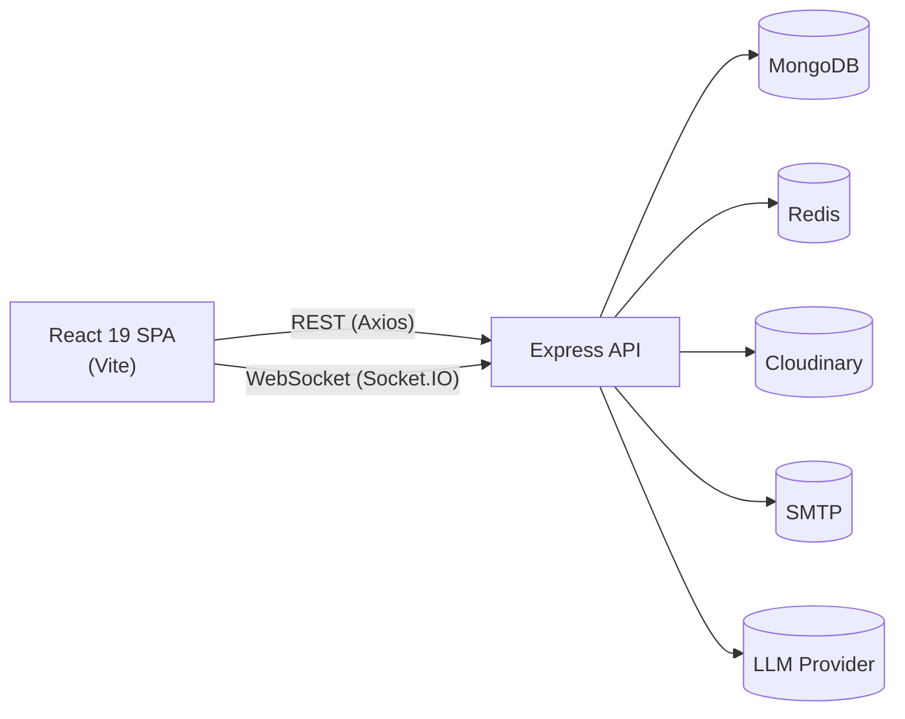

# Architecture

## Overview

CollabNote is a two-tier SPA + REST/WebSocket API application, organized as an npm-workspaces monorepo (`client/`, `server/`).



## Backend layering

The server follows a strict layered flow, each layer only depending on the one below it:

```
routes → controllers → services → repositories → models
```

- **routes/** — Express routers; wire URL + HTTP verb → middleware chain → controller. Own Swagger JSDoc annotations.
- **controllers/** — thin HTTP adapters: parse `req`, call a service, shape the `ApiResponse`. No business logic.
- **services/** — business logic, permission checks, orchestration across repositories, socket/notification side effects.
- **repositories/** — the only layer that talks to Mongoose models directly; centralizes queries so services stay storage-agnostic.
- **models/** — Mongoose schemas, indexes, instance methods (e.g. password hashing/compare).

Cross-cutting concerns live in `middlewares/` (auth, validation, rate limiting, error handling, file upload) and `utils/` (`ApiError`, `ApiResponse`, JWT helpers, pagination).

### Why a repository layer?

Services never import a Mongoose model directly. This keeps business rules (e.g. "only an owner can delete a note") independent of how data is fetched, and makes services straightforward to unit-test by mocking the repository.

## Authentication

- Passwords hashed with bcrypt (cost factor 12).
- Short-lived **access token** (15m) returned in the response body and set as an httpOnly cookie.
- Longer-lived **refresh token** (7–30d depending on "remember me") stored only as an httpOnly, path-scoped cookie.
- `tokenVersion` on the `User` document is incremented on logout / password change, immediately invalidating all previously issued tokens for that user (stateless revocation — no server-side token store required).
- `POST /api/v1/auth/refresh` rotates both tokens.

## Real-time collaboration

Socket.IO is used for:

- **Presence** — per-note-room in-memory presence store (`socket/presence.ts`) tracking connected collaborators, their cursor position, and typing state. Broadcast via `presence-sync`.
- **Live patches** — on every local edit, the editing client emits `note-patch` (full TipTap JSON + a monotonic version number). The server relays it to every other socket in the note's room. Receiving clients only apply a remote patch if their own editor is **not currently focused**, avoiding clobbering in-progress local typing. This is a deliberately simple "broadcast + last-write-wins persistence" strategy — it gives the collaborative feel of Google Docs without implementing a full CRDT/OT engine. For a production system, this is the natural point to swap in a proper CRDT (e.g. Yjs) if concurrent-edit conflict resolution needs to be exact rather than eventually-consistent.
- **Autosave** — edits are also debounced client-side (~1.2s) and persisted via a `save-note` socket event (services/note.service `update`), which snapshots a new version and bumps `currentVersion`. If the socket is disconnected, the client falls back to a REST `PATCH /notes/:id`.
- **Scaling** — `@socket.io/redis-adapter` fans events out across multiple Node processes/instances so real-time features work correctly behind a load balancer.

See `server/src/socket/index.ts` for the full event wiring and `constants/socketEvents.ts` for the event contract.

## Frontend structure

- **services/** — one Axios-based service module per REST resource (`note.service.ts`, `auth.service.ts`, …), plus `apiClient.ts` which centralizes the access-token header injection and silent refresh-on-401 retry logic.
- **hooks/** — TanStack Query hooks per resource (`useNotes`, `useNote`, `useNoteMutations`, …) — the only place components should reach for server state.
- **store/** — Zustand stores for client-only state: `authStore` (current user + in-memory access token — never persisted to avoid XSS-exposed tokens), `uiStore` (theme, sidebar), `presenceStore` (live collaborators for the currently open note).
- **components/ui/** — headless Radix primitives styled in the shadcn/ui convention (button, dialog, dropdown-menu, etc.) — the shared design-system layer.
- **pages/** — route-level components, lazy-loaded via `React.lazy` and code-split by Vite's `manualChunks`.

## Data model

| Model          | Purpose                                                                   |
| -------------- | ------------------------------------------------------------------------- |
| `User`         | account, auth, preferences                                                |
| `Workspace`    | top-level container a user's notes/folders belong to                      |
| `Folder`       | nested organization within a workspace                                    |
| `Note`         | the core document — TipTap JSON content, collaborators, share link, flags |
| `Version`      | immutable snapshot of a note at a point in time                           |
| `Comment`      | inline/threaded comments on a note                                        |
| `Notification` | in-app notification feed                                                  |
| `Invitation`   | pending email invitations to non-existing collaborators                   |
| `Attachment`   | uploaded files linked to a note (stored in Cloudinary)                    |
| `Activity`     | audit trail used by the admin activity log                                |

## Security

- `helmet`, `cors` (credentialed, origin-locked to `CLIENT_URL`), `express-rate-limit` (global + tighter auth/AI limiters), `express-mongo-sanitize`, `hpp`.
- All input validated at the boundary with Zod schemas (`validators/`) before reaching a controller.
- Centralized error handling maps Zod/Mongoose/JWT errors to consistent `ApiError` responses; stack traces are only included outside production.
- File uploads restricted by MIME type and size (Multer memory storage → streamed to Cloudinary, never written to local disk).
